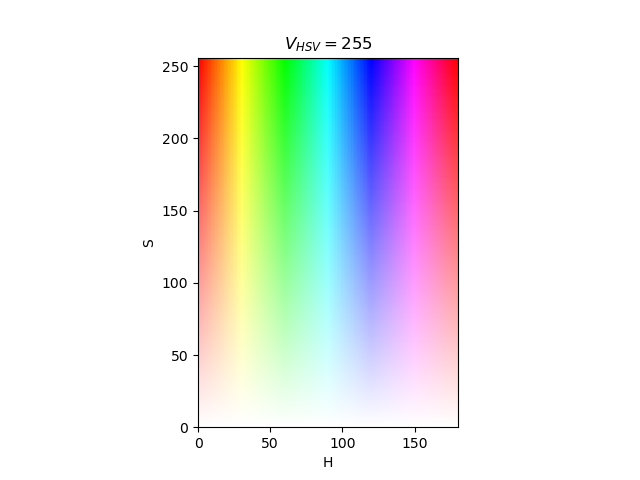

# Computer Vision Tricks with OpenCV and Other Computer Vision Libraries

## Projects

- `barcode_science`:  Detect QR codes with OpenCV erosion and dilations
- `polygon_science`:  Mask regions in a certain HSV color range and calculate polygons with OpenCV and Shaply

## Color maps

To find a color in HSV see the colormap below.  In OpenCV hue (H) is in the range 0-179, saturation (S) 0-255 and luminance (V) 0-255.  In the plot below ([source: stackoverflow](https://stackoverflow.com/questions/10948589/choosing-the-correct-upper-and-lower-hsv-boundaries-for-color-detection-withcv)), V is set to a constant value of 255.

## Helper scripts

To explore interactively upper and lower values for the HSV values (the color range) to be used in the main script, the app/tool `color_thresholder.py` may be used on an image (check the script to change input image).

To determine upper and lower values for colors using RGB values, the `find_hsv_ranges.py` will provide this (check the script for input RGB values).
