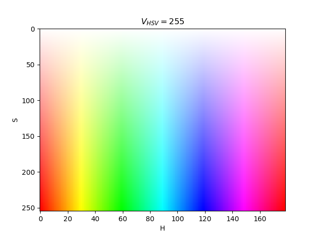

# Computer Vision Tricks with OpenCV and Other Computer Vision Libraries

## Projects

- `qrcode_science`:  Detect QR codes with OpenCV erosion and dilations
- `polygon_science`:  Mask regions in a certain HSV color range and calculate polygons with OpenCV and Shapely

## Color Space

To find a color in HSV see the colorspace plot below.  In OpenCV hue (H) is in the range 0-179, saturation (S) 0-255 and vibrance (V) 0-255.  In the plot below, V is set to a constant value of 255.

See `hsv_colorspace_plotter.py` to see how this image was made with the `matplotlib` library.

## Helper scripts

To explore interactively upper and lower values for the HSV values (the hue, saturation and vibrance), the app/tool `color_thresholder.py` may be used on an image (check the script to set the input image).

To determine upper and lower values for colors using RGB values, the `find_hsv_ranges.py` will provide this (check the script to set input RGB values).

To explore HSV masks and image results try out `explore_hsv_masks.py` (check the script to set the input image - right now it's set for two red ranges).
