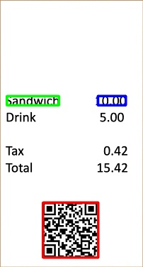

# Using OpenCV to Identify QR Codes

The purpose of this folder is to show how to identify areas of a certain color (potentially skewed) and detect QR/barcodes within the colored region.  A basic Python sample using OpenCV computer vision techniques is provided and operates on single images.  As-is, this sample works well on white receipts with the QR code.

We can take the following image as input, for example.

In the image results below, boundaries are drawn around the potential QR codes.  Below, the red square represents the top hit as it's the largest area (followed by green, then blue - based on size).  Only the top three hits are represented.

To achieve this, the script below performs the following.

1.  Find the most prominent white area and mask the image
2.  Identify the bounding box of the white area based on the mask
3.  Rotate the bounding box corresponding to the prominent white area to straighten it
4.  Crop the image based on the bounding box of the white area
5.  Identify the most prominent text-like object (QR code or similar) in the cropped, straightened image

## Running

To identify white receipts or stickers and the QR code(s), run the following python script.

    python detect_qr_codes.py --image data/qr_white.jpg

This will create a series of images to examine in the `results` folder (overwriting what is there).

## Limitations

For the QR code detection above, these are the considerations.

1. The QR code must have a white background (within a range in code) that is relatively bright – this can be tuned (but beware of sudden lightening changes!)
2. The area in which we find the QR code must be the largest bright white object on the pallet (we can tune color to ensure this, but changes in environment could throw this off) - check the `color_masked.jpg` in the `results` folder to what the algorithm masks out as largest white areas.
3. The white area in which the QR resides must be no more that 45 degrees skewed (relatively straight is best, however the algorithm does a very good job of straightening the area)
4. The top three largest QR code-like objects will be what are identified within the white area – ensure the barcode is the most prominent feature in the white area.

## Helper scripts

To explore interactively upper and lower values for the HSV values (the color range) to be used in the main script, the app/tool `color_thresholder.py` may be used on an image (check the script to change input image).

To determine upper and lower values for colors other than white using RGB values, the `find_hsv_ranges.py` will provide this (check the script for input RGB values).

## References

- Eroding and dilating with OpenCV:  https://docs.opencv.org/2.4/doc/tutorials/imgproc/erosion_dilatation/erosion_dilatation.html

## Credits

- https://www.learnopencv.com/invisibility-cloak-using-color-detection-and-segmentation-with-opencv/
- https://jdhao.github.io/2019/02/23/crop_rotated_rectangle_opencv/
- https://github.com/pyxploiter/Barcode-Detection-and-Decoding
