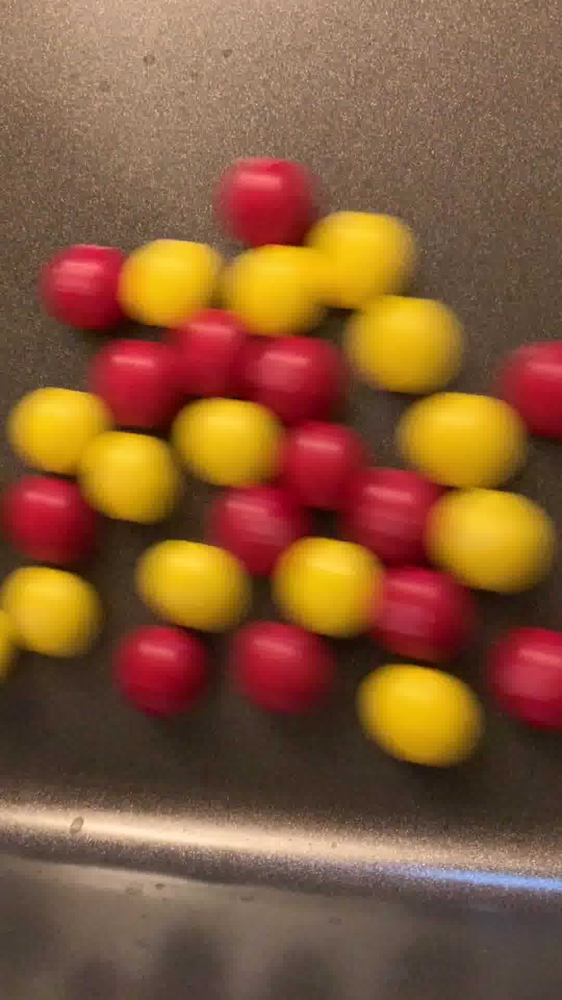

# Using OpenCV to Mask Based on Color and Calculate Polygons

We can take the following image as input, for example.

In the image results below, only the red candies are found (we intentionally search in a red HSV color space - we could have searched for yellow or both, however) and masked.  The actual polygons are available as well if you look at the `find_polygons_and_masks.py`.

## Setup

For Python 3, install the required libraries.

    pip install -r requirements.txt

## Running
v
To find red objects in an image by masking and determining the polygons, run the following python script.

    python find_polygons_and_masks.py --image ../data/skittles.jpg

